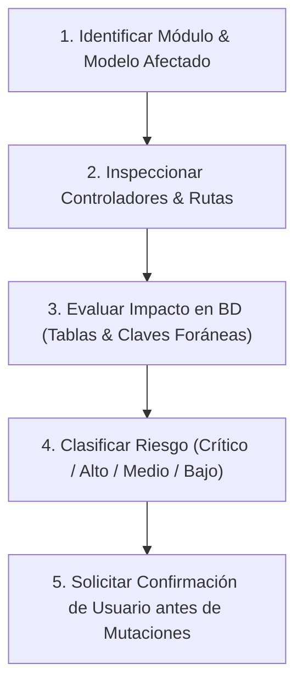

# Mapa Arquitectónico y Mapa de Módulos: OneClick Web ERP

> **PROYECTO:** OneClick Web ERP (Jose Vallecillo)  
> **FECHA DE ACTUALIZACIÓN:** Octubre 2026  
> **ARQUITECTURA:** Laravel (PHP) + Inertia.js + React 19 + TypeScript + Tailwind CSS v4 (Arquitectura Modular via `nwidart/laravel-modules`)

---

## 1. Visión General y Estructura del Sistema

**OneClick Web** es una plataforma ERP/CRM multi-módulo altamente escalable diseñada para la gestión empresarial integral. El sistema utiliza una arquitectura modular limpia donde cada vertical o función de negocio reside dentro de la carpeta `Modules/`.

### Estructura de Directorios Principal
* `/Modules/`: Contiene los 18 módulos verticales del sistema (Modelos, Controladores, Migraciones, Rutas y Componentes Inertia/React).
* `/app/`: Núcleo de la aplicación Laravel (Modelos globales `User`, `Profile`, Controladores base, Middlewares y Providers).
* `/resources/`: Componentes frontend React/Inertia compartidos, hooks, layouts y estilos globales con Tailwind CSS.
* `/routes/`: Rutas principales de Laravel (`web.php`, `api.php`, `console.php`).
* `/database/`: Migraciones globales, seeders y factories del sistema base.
* `/config/`: Archivos de configuración de Laravel y módulos.

---

## 2. Catálogo y Mapa Detallado de Módulos (18 Módulos)

### 1. Accounting (Contabilidad & Fiscalidad CAI/SAR)
* **Propósito:** Gestión contable general, libros principales, asientos de diario y facturación fiscal conforme a regulaciones SAR (Honduras).
* **Modelos ORM principales:**
  * `AccountingAccount` (Plan de cuentas contables)
  * `JournalEntry` & `JournalEntryLine` (Asientos contables)
  * `FiscalSequence` (Rangos y secuencias fiscales CAI / SAR)
  * `FiscalJournal` (Diarios contables)
  * `AccountingReconciliation` (Conciliación bancaria)
  * `CostCenter` (Centros de costo)
  * `AccountingLedger`, `AccountingAuditLog`
* **Controladores clave:** `AccountingConfigController`, `FiscalSequenceController`, `JournalEntryController`, `AccountingReportController`, `AccountingAccountController`.
* **Campos Críticos:** `cai_num`, `fsc`, `sequence_current`, `debit`, `credit`, `account_id`, `state`.

---

### 2. Inventory (Inventarios & Control de Stock)
* **Propósito:** Control multialmacén de productos, lotes, movimientos de stock, transferencias, ajustes, conteos físicos y depreciación.
* **Modelos ORM principales:**
  * `Product`, `ProductCategory`, `ProductPrice`, `ProductCostHistory`
  * `Warehouse` (Bodegas/Almacenes)
  * `StockMove` & `StockMoveLine` (Kardex y movimientos de stock)
  * `StockLot` (Control de lotes y vencimientos)
  * `StockQuantity` (Existencias por bodega)
  * `InventoryAdjustment`, `InventoryTransfer`, `InventoryReturn`, `PhysicalCount`
  * `UnitOfMeasure`, `ReorderSuggestion`, `ProductRecipeLine`, `InventoryDepreciation`
* **Controladores clave:** `ProductController`, `StockMoveController`, `InventoryTransferController`, `InventoryAdjustmentController`, `PhysicalCountController`, `StockLotController`.
* **Campos Críticos:** `quantity_on_hand`, `unit_cost`, `lot_number`, `warehouse_id`, `product_id`, `move_type`.

---

### 3. Pos (Punto de Venta & Facturación Rápida)
* **Propósito:** Operación en caja registradora para restaurantes, comercios y tiendas, integración con impresión de recibos y comandas.
* **Modelos ORM principales:**
  * `PosSession` (Apertura y cierre de caja)
  * `PosSale` & `PosSaleLine` (Ventas en punto de venta)
  * `PosOrder` & `PosOrderLine` (Órdenes activas)
  * `FiscalDocument` (Documentación fiscal vinculada a POS)
  * `KitchenTicket` & `KitchenTicketItem` (Comandas de cocina)
  * `PosTable` (Mapeo de mesas)
  * `PosWaiter` (Meseros/Atendedores)
  * `ReceiptPrint`, `PosPromotion`
* **Controladores clave:** `PosSessionController`, `PosSaleController`, `PosOrderController`, `KitchenTicketController`, `FiscalIntegrationController`, `PosClosingController`.
* **Campos Críticos:** `session_id`, `total_amount`, `fiscal_number`, `table_id`, `status`.

---

### 4. Contacts (Directorio Unificado de Contactos)
* **Propósito:** Maestro unificado de clientes, proveedores, empleados y socios comerciales.
* **Modelos ORM principales:**
  * `Contact` (Directorio principal)
  * `ContactGroup`, `ContactTag` (Categorización)
  * `ContactBankDetail` (Cuentas bancarias de proveedores/clientes)
  * `ContactCustomField`, `ContactCustomFieldValue` (Campos dinámicos)
  * `ContactDocument`, `ContactAuditLog`
* **Controladores clave:** `ContactsController`, `ContactTagsController`, `ContactBankDetailsController`, `ContactDocumentsController`, `SupplierEvaluationController`.
* **Campos Críticos:** `tax_id` (RTN/DNI), `type` (customer, supplier, both), `name`, `email`, `phone`.

---

### 5. Microfinance (Gestión de Créditos & Microfinanzas)
* **Propósito:** Administración de expedientes crediticios, planes de amortización, cobros en ruta, buró de crédito y análisis AML.
* **Modelos ORM principales:**
  * `MfClient`, `MfLoanProduct`
  * `MfLoan` (Expediente de préstamo)
  * `MfLoanSchedule` (Tabla de amortización)
  * `MfLoanPayment` (Registro de pagos)
  * `MfCollectionRoute` & `MfCollectionRouteStop` (Rutas de cobro)
  * `MfCreditGroup` & `MfCreditGroupMember` (Bancos comunales/grupos solidarios)
  * `MfAmlAlert`, `MfCreditBureauSnapshot`, `MfPortfolioReconciliation`
* **Controladores clave:** `MfLoanController`, `MfClientController`, `MfCollectionController`, `MfTreasuryController`, `MfGroupController`.
* **Campos Críticos:** `principal_amount`, `interest_rate`, `balance_remaining`, `due_date`, `status`.

---

### 6. Sales (Ventas & Pedidos)
* **Propósito:** Gestión de cotizaciones, pedidos de venta formales y trazabilidad comercial.
* **Modelos ORM principales:** `SalesOrder`, `SalesOrderLine`, `SalesAuditLog`.
* **Controlador clave:** `SalesOrderController`.
* **Campos Críticos:** `order_number`, `customer_id`, `total`, `status` (draft, confirmed, invoiced, cancelled).

---

### 7. Purchases (Compras & Abastecimiento)
* **Propósito:** Gestión de solicitudes y órdenes de compra a proveedores.
* **Modelos ORM principales:** `PurchaseOrder`, `PurchaseOrderLine`, `PurchasesAuditLog`.
* **Controlador clave:** `PurchaseOrderController`.
* **Campos Críticos:** `supplier_id`, `po_number`, `subtotal`, `tax`, `total`, `status`.

---

### 8. AutoLote (Comercialización de Vehículos)
* **Propósito:** Compra, venta, consignación, inspección y financiamiento de vehículos.
* **Modelos ORM principales:**
  * `AutoLoteVehicle` (Inventario de vehículos por VIN)
  * `AutoLoteSale` (Contratos de venta)
  * `AutoLoteInspection` (Hojas de estado/mantenimiento)
  * `AutoLoteExpense` (Gastos asociados por unidad)
  * `AutoLoteFinancing`, `AutoLoteContract`
* **Controladores clave:** `AutoLoteVehicleController`, `AutoLoteSaleController`, `AutoLoteInspectionController`.
* **Campos Críticos:** `vin`, `plate_number`, `purchase_price`, `selling_price`, `status`.

---

### 9. CarService (Taller Mecánico & Mantenimiento Vehicular)
* **Propósito:** Control de órdenes de trabajo en taller, diagnóstico, mano de obra y repuestos.
* **Modelos ORM principales:** `CarServiceVehicle`, `CarServiceWorkOrder`, `CarServiceInspection`, `CarServiceLaborItem`, `CarServicePartUsage`.
* **Controlador clave:** `CarServiceWorkOrderController`.
* **Campos Críticos:** `work_order_number`, `vehicle_id`, `odometer`, `labor_total`, `parts_total`, `status`.

---

### 10. Barbershop (Servicios Estéticos & Barberías)
* **Propósito:** Agenda de citas, liquidación de comisiones a barberos y asignación de sillas/estaciones.
* **Modelos ORM principales:** `BarbershopSpecialist`, `BarbershopService`, `BarbershopStation`, `BarbershopAppointment`, `BarbershopCommission`.
* **Controlador clave:** `BarbershopAppointmentController`.
* **Campos Críticos:** `specialist_id`, `appointment_time`, `commission_rate`, `total_price`, `status`.

---

### 11. Hospitality (Hoteles & Administración de Hospedaje)
* **Propósito:** Reservación de habitaciones, tipos de habitación, folios de cargos y recepción.
* **Modelos ORM principales:** `RoomType`, `Room`, `Reservation`, `Folio`.
* **Controladores clave:** `ReservationController`, `RoomController`, `RoomTypeController`.
* **Campos Críticos:** `room_number`, `check_in`, `check_out`, `nightly_rate`, `reservation_status`.

---

### 12. RealEstate (Bienes Raíces & Inmobiliaria)
* **Propósito:** Catálogo de propiedades, embudo de clientes potenciales (Leads), contratos de venta/alquiler, planes de cuotas e ingresos por administración de condominios.
* **Modelos ORM principales:** `Property`, `RealEstateLead`, `RealEstateDeal`, `PaymentPlan`, `PaymentInstallment`, `CondoFee`, `Commission`, `SupportTicket`.
* **Controladores clave:** `PropertyController`, `RealEstateLeadController`, `RealEstateDealController`, `PaymentPlanController`, `CondoFeeController`.
* **Campos Críticos:** `property_code`, `price`, `deal_stage`, `installment_amount`, `status`.

---

### 13. Rentals (Renta de Equipos & Bienes)
* **Propósito:** Alquiler de activos, tarifas por periodo, inspecciones de entrega/devolución.
* **Modelos ORM principales:** `RentalOrder`, `RentalOrderLine`, `RentalRate`, `RentalChecklist`, `RentalMaintenance`.
* **Controladores clave:** `RentalOrderController`, `RentalRateController`, `RentalReportController`.
* **Campos Críticos:** `start_date`, `end_date`, `deposit_amount`, `status`.

---

### 14. Governance (Gobernanza & Validación Dinámica)
* **Propósito:** Reglas de validación en tiempo real para interfaces de usuario, restricciones dinámicas y auditoría avanzada.
* **Modelos ORM principales:** `UiGovernanceRule`, `GovernanceFieldValidator`, `GovernanceAuthRequest`, `GovernanceAuditLog`.
* **Controladores clave:** `GovernanceController`.

---

### 15. AppStore (Gestor de Aplicaciones y Módulos)
* **Propósito:** Catálogo interno para activar/desactivar módulos verticales y gestionar licencias de componentes.
* **Modelos ORM principales:** `AppListing`, `InstalledModule`, `AppDependency`, `AppReview`.

---

### 16. Subscriptions (Suscripciones & SaaS)
* **Propósito:** Administración de planes de licenciamiento del software OneClick.
* **Modelos ORM principales:** `SubscriptionPlan`, `Subscription`, `LicenseToken`, `SubscriptionsAuditLog`.
* **Controladores clave:** `SubscriptionsController`, `SubscriptionExpiredController`.

---

### 17. Settings (Configuración Global & Empresa)
* **Propósito:** Datos de la empresa, sucursales, monedas, impuestos (ISV 15%/18%) y parámetros del sistema.
* **Modelos ORM principales:** `Company`, `Branch`, `Currency`, `TaxRate`, `Setting`, `SettingsAuditLog`.
* **Controladores clave:** `SettingsController`.

---

### 18. Users (Gestión de Usuarios & Seguridad)
* **Propósito:** Roles, permisos, perfiles y trazabilidad de accesos.
* **Modelos ORM principales:** `User`, `Profile`, `UserAuditLog`.
* **Controladores clave:** `UsersController`, `ProfileController`, `SecurityController`.

---

## 3. Protocolo Obligatorio de Evaluación y Evaluación de Riesgos (Pre-flight)

Antes de implementar cualquier cambio de código, modificación de esquema o refactorización en **OneClick Web**, se debe seguir el siguiente flujo estricto:

### Tabla de Riesgos de Impacto

| Nivel de Riesgo | Ámbitos Afectados | Ejemplos de Operaciones |
| :--- | :--- | :--- |
| **CRÍTICO** | Accounting, FiscalSequence (CAI/SAR), Migraciones BD | Alterar lógica de asientos contables, campos CAI o tablas de facturación fiscal. |
| **ALTO** | Inventory (StockMove/Lot), Pos (PosSession), Microfinance (MfLoanSchedule) | Modificar cálculo de stock disponible, cierre de caja POS o amortizaciones de préstamo. |
| **MEDIO** | Controllers de Ventas/Compras, Filtros de React/Inertia | Cambiar lógica de presentación en vistas Inertia o filtros de consulta. |
| **BAJO** | Textos UI, componentes visuales isolated, traducciones | Modificaciones estilísticas en Tailwind o layouts visuales. |

---

## 4. Reglas de Operación Estrictas

1. **Modo Consulta y Confirmación:** No aplicar mutaciones en la base de datos o archivos sin aprobación previa del usuario.
2. **Evaluación de Impacto:** Revisar siempre las dependencias cruzadas entre módulos (ej. `Pos` -> `Inventory` + `Accounting` + `Contacts`).
3. **Verificación Empírica:** Al ejecutar cambios autorizados, realizar comprobación sintáctica y de build (`npm run types:check` / `php artisan test` según aplique).
